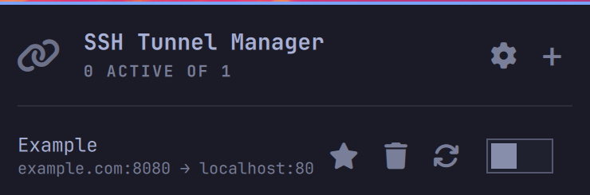

# SSH Tunnel Manager

<p>
  <a href="LICENSE"></a>
  <a href="https://github.com/tcballard/omarchy-badges"></a>
  <a href="#compatibility"></a>
</p>

An [Omarchy](https://omarchy.org)/Quickshell plugin for creating, monitoring,
and toggling SSH port-forward tunnels from the status bar — local (`-L`),
remote (`-R`), and dynamic SOCKS (`-D`) — using your existing `~/.ssh/config`
and SSH agent.



## Features

- **Create/edit/delete tunnels** for all three SSH forward types from a
  single bar-widget panel, with autocomplete against your `~/.ssh/config`
  hosts.
- **Live status**, refreshed on a poll interval, including a proactive
  connection-health probe that flags a tunnel whose remote destination is
  refusing or failing connections — not just whether the SSH session itself
  is up.
- **Auto-discovery of foreign tunnels.** Any `ssh -L`/`-R`/`-D` process
  already running on the system that wasn't started by this plugin is
  automatically adopted and shown (read-only, kill-only) alongside your own
  — toggleable in Preferences.
- **Favourites + auto-restart.** Mark a tunnel as a favourite to keep it
  across shell/machine restarts; enable auto-restart to have it start
  automatically on the next shell startup. A non-favourited tunnel's
  definition is pruned on restart (the live process, if still running, is
  simply re-adopted as a foreign tunnel).
- **autossh-aware.** Stopping a tunnel that's actually supervised by
  `autossh` can optionally stop the supervisor too, so it doesn't just
  respawn.

## Installation

This is an Omarchy plugin. With the Omarchy CLI installed:

```sh
omarchy plugin add --enable fabuseless.ssh-tunnel-manager https://github.com/fabuseless/ssh-tunnel-manager
```

To update after pulling changes:

```sh
omarchy plugin update fabuseless.ssh-tunnel-manager --yes
omarchy restart shell
```

### Removal

```sh
omarchy plugin remove fabuseless.ssh-tunnel-manager --yes
omarchy restart shell
```

## Dependencies

`bin/tunnel-ctl` shells out to a handful of standard tools, all normally
present on an Omarchy install:

- `ssh` — spawns and controls every tunnel.
- `jq` — reads/writes/validates `tunnels.json`.
- `bash`, `flock`, `setsid` — process/lock management (`flock`/`setsid` are
  part of util-linux).
- `autossh` (optional) — only needed if you run autossh-supervised tunnels
  and want the "fully stop autossh" preference to have anything to act on.

## Compatibility

Targets the Omarchy 4 Quattro shell-plugin contract (4.0.0+). Developed and
tested against Omarchy 4.0.4-1 (`omarchy-version`).

Runs entirely with your normal user permissions. No sudo or pkexec is
required, and it never installs packages.

## Architecture

- **`bin/tunnel-ctl`** — the sole owner of `tunnels.json` and every `ssh`
  process this plugin spawns or kills. QML never touches either directly;
  every action goes through this script, serialized behind a file lock. See
  the header comment in that file for the full action list and the
  security invariants around process discovery and teardown (argv-based
  spawning, control-socket-based liveness, re-verified kill targets, etc.).
- **`Service.qml`** — the plugin's `service` entry point: polls
  `tunnel-ctl status`, exposes tunnel state to the UI, and wraps every
  mutating action (create/update/delete/start/stop/favourite/auto-restart)
  with optimistic local state that reconciles against the next confirmed
  poll.
- **`Panel.qml`** — the `bar-widget` entry point: the tunnel list, per-row
  controls, and the panel header's Preferences/New-tunnel actions.
- **`Settings.qml`** — the `overlay` entry point: the create/edit tunnel
  form and the Preferences screen.
- **`ConfigStore.js`** — client-side-only validation mirroring
  `tunnel-ctl`'s own rules, so the form can show inline errors without a
  subprocess round trip for common mistakes. `tunnel-ctl` re-validates
  everything from scratch regardless and is the authoritative boundary.
- **`TunnelProcessController.qml`** — runs one `tunnel-ctl` invocation per
  tunnel id as its own process, so an action on one tunnel never blocks
  another.

## License

MIT — see [LICENSE](LICENSE).
